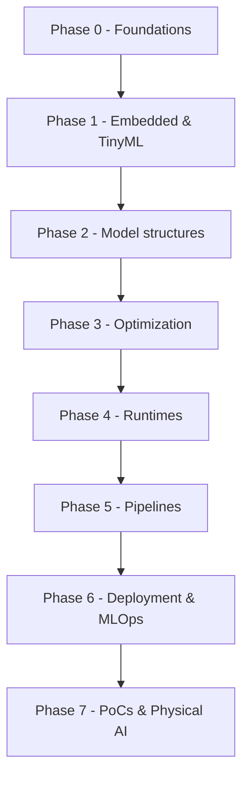

<!--
  BEFORE YOU PUBLISH:
  1. Replace the social-preview image in repo Settings → "Social preview".
  2. Add the GitHub topics listed in awesome-resources/README.md (Settings → Topics).
-->

<div align="center">

# Awesome Edge AI [](https://awesome.re)

### A complete, beginner-to-advanced roadmap for running AI on real-world devices — with verified, runnable projects.

*Most "awesome" lists are a pile of links. This one is a **path**: eight ordered phases from Linux and tensors to real-time, on-device inference and Physical AI — paired with **sample projects that run as written** (one ships with an offline self-test), **PoCs and real-time use cases by industry**, and **honestly annotated** courses, books, and docs. Built to take you from zero to shipping.*

[](LICENSE)
[](https://creativecommons.org/licenses/by/4.0/)
[](CONTRIBUTING.md)
<br/>
[](https://github.com/Premchand006/awesome-edge-ai/actions/workflows/link-check.yml)
[](https://github.com/Premchand006/awesome-edge-ai/actions/workflows/awesome-lint.yml)
[](https://github.com/Premchand006/awesome-edge-ai/commits)
[](https://github.com/Premchand006/awesome-edge-ai/stargazers)

</div>

---

> [!TIP]
> **New here? Start with the [zero-hardware project](sample-projects/onnxruntime-image-classification.md).** It classifies images on your CPU — no GPU, no NPU — and ships with a `--selftest` that verifies your setup offline. Then follow [the roadmap](#-the-roadmap) phase by phase.

## 📖 Table of Contents

- [🎯 Why This Repo](#-why-this-repo)
- [🧭 The Roadmap](#-the-roadmap)
- [🚀 PoCs and Real-Time Use Cases](#-pocs-and-real-time-use-cases)
- [🧩 Sample Projects](#-sample-projects)
- [🧠 The Core Skill: Optimization](#-the-core-skill-optimization)
- [📊 Runtime Selection](#-runtime-selection)
- [📚 Courses and Books](#-courses-and-books)
- [🔁 Renames and Deprecations](#-renames-and-deprecations)
- [📚 Repository Structure](#-repository-structure)
- [🤝 Contributing](#-contributing)
- [📞 Support and Community](#-support-and-community)
- [🙏 Acknowledgements](#-acknowledgements)
- [⭐ Support This Project](#-support-this-project)
- [📄 License](#-license)

> Welcome 👋 — whether you're a firmware engineer learning ML, an ML engineer learning embedded, or a student starting fresh, the [roadmap](#-the-roadmap) meets you where you are and the [sample projects](#-sample-projects) get you running today.

---

## 🎯 Why This Repo

*Edge AI has a brutal learning curve: a dozen runtimes, constant renames, and tutorials that don't run. This repo fixes the three things that stall people.*

### 1. "Where do I even start, and in what order?"
- A single, ordered **8-phase roadmap** from foundations to Physical AI. → [The Roadmap](#-the-roadmap)
- Every phase says *what to learn, why it matters, and what's next.*

### 2. "I tried a tutorial and it didn't run."
- **Sample projects that run as written**, with one-command installs, exact model-download commands, and expected output. → [Sample Projects](#-sample-projects)
- The flagship project includes an **offline self-test** and unit-tested helpers.

### 3. "Half of what I read is out of date."
- A living **renames/deprecations** page (TFLite→LiteRT, Coral dead, ArmNN EP removed). → [Renames & Deprecations](#-renames-and-deprecations)
- Curated resources are **annotated** with level and cost; free and authoritative ones come first. → [Courses & Books](#-courses-and-books)

### Plus: from learning to *doing*
- **PoCs and real-time use cases by industry**, each mapped to roadmap phases and a starting project. → [PoCs & Use Cases](#-pocs-and-real-time-use-cases)

---

## 🧭 The Roadmap

The full, detailed path lives in **[roadmap/](roadmap/README.md)**. The short version:



| Phase | Focus | Go to |
|---|---|---|
| **0** | Linux, Python/C++, ML basics | [foundations](foundations/README.md) |
| **1** | Embedded systems & TinyML | [foundations](foundations/README.md) |
| **2** | CNNs, ViT, MobileNet/YOLO | [model-structures](model-structures/README.md) |
| **3** | Quantization, pruning, distillation | [model-optimization](model-optimization/README.md) |
| **4** | ONNX RT, LiteRT, TensorRT, OpenVINO, TVM | [runtimes-and-frameworks](runtimes-and-frameworks/README.md) |
| **5** | GStreamer, DeepStream, ROS 2 | [pipelines](pipelines/README.md) |
| **6** | Containers, OTA, monitoring | [deployment-and-mlops](deployment-and-mlops/README.md) |
| **7** | PoCs, use cases, Physical AI | [poc-and-use-cases](poc-and-use-cases/README.md) |

---

## 🚀 PoCs and Real-Time Use Cases

Where the roadmap pays off. Full catalog — with reference PoCs and starting points — in **[poc-and-use-cases/](poc-and-use-cases/README.md)**.

| Industry | Real-time use case | Typical stack |
|---|---|---|
| Manufacturing | defect detection; predictive maintenance | YOLO + TensorRT/Hailo; TinyML |
| Retail | checkout-free vision; shelf analytics | detection + tracking on Hailo/Qualcomm |
| Smart city / security | multi-camera analytics; ANPR | DeepStream multi-stream on Jetson |
| Automotive | driver monitoring; ADAS; autonomous trucking | Ambarella / Qualcomm / NVIDIA |
| Healthcare | surgical guidance; patient monitoring | Holoscan; edge SoCs |
| Agriculture | weed/pest detection; autonomous machinery | YOLO on Jetson/edge NPU |
| Robotics | AMR navigation; pick-and-place; VLA policies | ROS 2 + Isaac ROS |

**Buildable PoCs** range from a zero-hardware classifier to an on-device LLM and a robot perception node — each lists its problem, approach, phases, and a starting project. → [See all PoCs](poc-and-use-cases/README.md)

---

## 🧩 Sample Projects

Hands-on and **verified**. Full index and our "verified & easy" bar in **[sample-projects/](sample-projects/README.md)**.

| Project | Level | Hardware | Builds |
|---|---|---|---|
| [Zero-hardware image classification](sample-projects/onnxruntime-image-classification.md) | Beginner | Any laptop/PC | CPU classifier with ONNX Runtime (+ self-test) |
| [Raspberry Pi + Hailo live detection](sample-projects/pi5-hailo-live-detection.md) | Beginner→Intermediate | Pi 5 + Hailo | real-time detection pipeline |
| [Jetson + YOLO detection](sample-projects/jetson-yolo-detection.md) | Intermediate | NVIDIA Jetson | high-FPS detection via TensorRT |

> The flagship project is a real, runnable program: [`sample-projects/onnxruntime-classify/classify.py`](sample-projects/onnxruntime-classify/classify.py) — heavily commented, with `--selftest` and unit-tested helpers.

---

## 🧠 The Core Skill: Optimization

If you learn one thing deeply, make it this. A cloud model is too big for a 2.5 W device; **quantization, pruning, and distillation** close the gap. Full treatment in **[model-optimization/](model-optimization/README.md)**.

- **Quantization** (FP32 → INT8/INT4) — the highest-leverage edge optimization.
- **Pruning** — remove low-value weights/channels.
- **Distillation** — train a small student from a large teacher.
- **Tools:** ONNX Runtime quantization, OpenVINO **NNCF**, **TensorRT Model Optimizer**.
- **Anchor:** MIT 6.5940 (Song Han) — the textbook-grade, free course.

---

## 📊 Runtime Selection

Pick by target hardware (full matrix in [runtimes-and-frameworks/](runtimes-and-frameworks/README.md)):

> **NVIDIA?** TensorRT. **Intel?** OpenVINO. **Phone/MCU?** LiteRT. **Rockchip?** RKNN. **Not sure / many targets?** ONNX Runtime.

| Runtime | Best for | Hardware |
|---|---|---|
| **ONNX Runtime** | portability | CPU, GPU, NPU (via EPs) |
| **LiteRT** (was TF Lite) | mobile & MCUs | Arm CPU/GPU/NPU/MCU |
| **TensorRT** | max NVIDIA perf | NVIDIA GPU / Jetson |
| **OpenVINO** | Intel everywhere | Intel CPU/iGPU/NPU/Arc |
| **RKNN** | Rockchip SBCs | RK3588 NPU |

---

## 📚 Courses and Books

Hand-vetted and annotated by level/cost in **[courses-and-books/](courses-and-books/README.md)**. Highlights (all free):

- **MIT 6.5940 — TinyML & Efficient Deep Learning** (advanced; the optimization anchor).
- **Microsoft edgeai-for-beginners** (8 modules, 50+ samples).
- **DeepLearning.AI — Introduction to On-Device AI** (short, with Qualcomm).
- **Edge Impulse — Edge AI Fundamentals** and **Qualcomm Academy — Technical Foundations** (foundations).

---

## 🔁 Renames and Deprecations

Don't follow dead tutorials. Full page: **[renames-and-deprecations.md](renames-and-deprecations.md)**.

| If a tutorial says… | Do instead |
|---|---|
| `import tensorflow.lite` | use **LiteRT** (`.tflite` unchanged) |
| "install the Coral Edge TPU" | use **Hailo / MemryX / RK3588** |
| "Raspberry Pi AI Kit" | **AI HAT+ / AI HAT+ 2** |
| "OpenVINO Model Optimizer (`mo`)" | **OVC** + `optimum-intel` |
| "ONNX Runtime ArmNN EP" | CPU EP (KleidiAI) or QNN |

---

## 📚 Repository Structure

```text
awesome-edge-ai/
├── roadmap/                  # the 8-phase beginner → advanced path
├── foundations/              # Phase 0–1: Linux, Python/C++, ML basics, TinyML
├── model-structures/         # Phase 2: CNNs, ViT, MobileNet/EfficientNet/YOLO
├── model-optimization/       # Phase 3: quantization, pruning, distillation
├── runtimes-and-frameworks/  # Phase 4: ONNX RT, LiteRT, TensorRT, OpenVINO, TVM, RKNN
├── pipelines/                # Phase 5: GStreamer, DeepStream, ROS 2 / Isaac ROS
├── deployment-and-mlops/     # Phase 6: export funnel, containers, OTA, monitoring
├── poc-and-use-cases/        # Phase 7: PoCs + real-time use cases by industry
├── sample-projects/          # verified, runnable projects (+ classify.py)
├── courses-and-books/        # annotated learning resources by phase
├── awesome-resources/        # curated link collection
└── renames-and-deprecations.md
```

### Explore by section
- 🧭 **[Roadmap](roadmap/README.md)** — the ordered path.
- 🧱 **[Foundations](foundations/README.md)** — Linux, Python, ML basics, TinyML.
- 🧠 **[Optimization](model-optimization/README.md)** — the core edge skill.
- 📦 **[Runtimes](runtimes-and-frameworks/README.md)** — pick the right engine.
- 🎥 **[Pipelines](pipelines/README.md)** — real-time data in, results out.
- 🚀 **[PoCs & Use Cases](poc-and-use-cases/README.md)** — apply it to real problems.
- 🧩 **[Sample Projects](sample-projects/README.md)** — build something today.
- ⭐ **[Awesome Resources](awesome-resources/README.md)** — the curated list.

---

## 🤝 Contributing

This is a living curriculum — help keep it sharp. **Great contributions:** a new runnable sample project, a clearer explanation, a high-signal resource, or a rename/deprecation fix. Sample projects must **run exactly as written** (the bar is in **[CONTRIBUTING.md](CONTRIBUTING.md)**), and CI runs `awesome-lint` + a link checker on every PR.

**Quality standards:** projects run as written with expected output shown; resources are annotated by level/cost; explanations teach the *why*.

Look for [`good first issue`](https://github.com/Premchand006/awesome-edge-ai/labels/good%20first%20issue) and [`help wanted`](https://github.com/Premchand006/awesome-edge-ai/labels/help%20wanted).

## 📞 Support and Community

- 🐛 **Issues** — propose a project, suggest a resource, or report a dead link/stale tutorial (templates provided).
- 💡 **Discussions / PRs** — improve the roadmap or add a PoC; see [CONTRIBUTING.md](CONTRIBUTING.md).
- 🔁 **Found something outdated?** — in a field this fast, fixing a stale step is the most valuable contribution you can make.

---

## 🙏 Acknowledgements

Built in the spirit of the [Awesome](https://awesome.re) movement and the open edge-AI, TinyML, and robotics communities. Course, tool, and product names belong to their respective owners; this is an independent, vendor-neutral learning resource.

## ⭐ Support This Project

- ⭐ **Star** the repo so more learners find a path that actually runs.
- 🔗 **Share** it with someone starting out in edge AI or TinyML.
- 🤝 **Contribute** a project, a fix, or an annotated resource.

## 📄 License

Prose: **CC BY 4.0**. Code/snippets: **MIT**. See [LICENSE](LICENSE).

---

<div align="center">

**From "what's a tensor?" to shipping real-time AI on real devices.**
*Ordered • Runnable • Honestly annotated • Community-curated*

</div>
