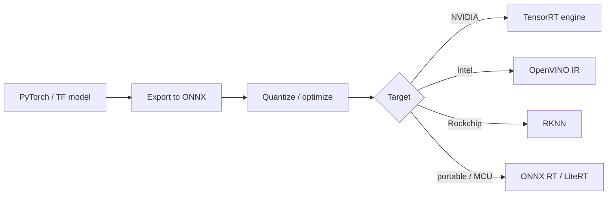

# Phase 6: Deployment & MLOps at the Edge

Getting a model to run once on your desk is a demo. Running it reliably on many devices, updating it safely, and knowing when it breaks is **edge MLOps** — and it's what separates a project from a product.

## The export funnel
Almost every edge deployment passes through this funnel:

ONNX is the common interchange format; from there you compile to the target's native runtime ([Phase 4](../runtimes-and-frameworks/README.md)).

## Packaging & reproducibility
- **Containers** (Docker) pin dependencies so "works on my board" becomes "works on every board." NVIDIA's L4T base images and Balena are common for fleets.
- **Pin everything**: model version, runtime version, and driver/JetPack version. A TensorRT engine is tied to a specific GPU + TensorRT version — rebuild on target.

## Over-the-air (OTA) updates
Fleets need safe remote updates of both the app and the model:
- Atomic, **rollback-capable** updates (a bad model shouldn't brick a robot).
- Decouple **model updates** from app updates where possible (ship a new `.onnx`/engine without a full redeploy).
- Tools/platforms: Balena, Mender, AWS IoT Greengrass, Azure IoT Edge.

## Monitoring & observability
You can't fix what you can't see:
- **System metrics**: latency, FPS, CPU/GPU/NPU utilization, temperature, power, memory.
- **Model metrics**: confidence distributions, detection rates, and **data drift** (the field changes; the model goes stale).
- Lightweight on-device logging + periodic upload of summaries (not raw video) respects bandwidth and privacy.

## Edge MLOps checklist
| Stage | Question to answer |
|---|---|
| Build | Is the model versioned and reproducible? |
| Package | Containerized with pinned runtime + drivers? |
| Deploy | Atomic update with automatic rollback? |
| Monitor | Are latency, health, and drift observed? |
| Iterate | Can you retrain on field data and re-ship safely? |

## The feedback loop
The best edge systems close the loop: collect (privacy-preserving) field data → retrain/optimize → validate → OTA update → monitor. This is the production version of the [three-computer workflow](../poc-and-use-cases/README.md) used in Physical AI.

➡️ Next: put it all together in [PoCs & use cases](../poc-and-use-cases/README.md) and [sample projects](../sample-projects/README.md).
