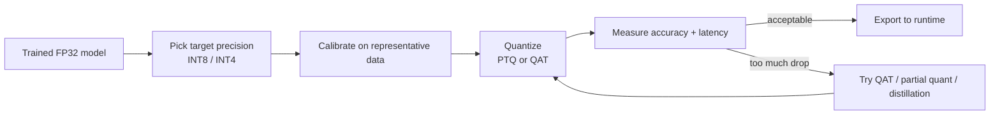

# Phase 3: Model Optimization

This is *the* defining skill of edge AI. A model trained in FP32 on a cloud GPU is usually too big, too slow, and too power-hungry for a device drawing a few watts. Optimization closes that gap — often shrinking a model 4× and speeding it up several-fold with minimal accuracy loss.

## Why it's necessary
A constrained device has hard limits on memory, compute, and power. The goal is to fit under those limits while preserving accuracy. Three techniques do most of the work.

## 1. Quantization (start here)
Represent weights/activations in lower precision — **FP32 → INT8** (4× smaller, much faster) or even **INT4**. This is the highest-leverage optimization for the edge.

| Approach | What it is | Trade-off |
|---|---|---|
| **Post-Training Quantization (PTQ)** | quantize an already-trained model using a small calibration set | fast, easy; small accuracy drop |
| **Quantization-Aware Training (QAT)** | simulate quantization *during* training | best accuracy; needs training pipeline |

**Key point:** INT8 and INT4 are not free — accuracy can drop, especially for transformers. Always measure on *your* data. Some vendors (e.g., DeepX IQ8) claim near-FP32 accuracy at INT8; verify.

## 2. Pruning
Remove weights or whole channels that contribute little.
- **Unstructured** (zero out individual weights) — high compression, but needs sparse-aware hardware to speed up.
- **Structured** (remove channels/filters) — directly smaller and faster on ordinary hardware.

## 3. Knowledge distillation
Train a small "student" model to mimic a large "teacher," transferring accuracy into a far smaller network. Common for shrinking LLMs/VLMs to edge-deployable sizes.

## The toolchain
| Tool | Use it for | Notes |
|---|---|---|
| **ONNX Runtime quantization** | framework-agnostic PTQ to INT8 | pairs with the ONNX RT [runtime](../runtimes-and-frameworks/README.md) |
| **OpenVINO NNCF** | PTQ + QAT for Intel targets | use `nncf.quantize()` (the old `create_compressed_model()` is deprecated) |
| **TensorRT Model Optimizer** | quantization/sparsity for NVIDIA | feeds TensorRT engine builds |
| **PyTorch (`torch.ao.quantization`)** | native PTQ/QAT | export to ONNX afterward |

## A typical optimization workflow

## The authoritative resource
**MIT 6.5940 — TinyML and Efficient Deep Learning Computing (Prof. Song Han)** is the textbook-grade course on exactly this: pruning, quantization, neural architecture search, distillation, and LLM/diffusion acceleration. Lectures are free on YouTube; materials at [efficientml.ai](https://efficientml.ai/). See [courses-and-books](../courses-and-books/README.md).

➡️ Next: run your optimized model on a [runtime](../runtimes-and-frameworks/README.md).
