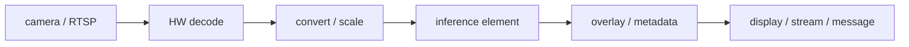
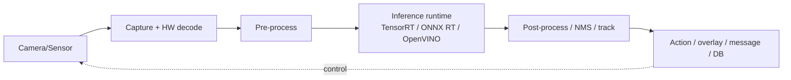

# Phase 5: Real-Time Pipelines

A model is only useful when real data flows through it continuously. A **pipeline** captures frames (or sensor data), pre-processes them, runs inference, and routes results — all in real time, ideally without copying data needlessly. This is what turns a model into a product.

## Why pipelines matter
Naively decoding video in Python and calling a model per frame drops frames fast. Production pipelines use **zero-copy** buffers, hardware decoders, and batching to hit real-time throughput on modest hardware.

## GStreamer — the foundation
**[GStreamer](https://gstreamer.freedesktop.org/)** is the open multimedia framework most edge-vision stacks build on. You connect **elements** (source → decode → convert → infer → sink) into a pipeline; data flows through as buffers. Learning GStreamer basics pays off because **DeepStream**, **DL Streamer**, and Hailo's **TAPPAS** are all GStreamer-based.

## DeepStream (NVIDIA) & DL Streamer (Intel)
- **[DeepStream](https://developer.nvidia.com/deepstream-sdk)** is NVIDIA's GStreamer-based analytics SDK: hardware-accelerated multi-stream decode + TensorRT inference + tracking, scaling to dozens of camera streams on a single Jetson/GPU.
- **Intel DL Streamer** is the analogous OpenVINO-based pipeline for Intel hardware.

## ROS 2 — the robotics backbone
For robots, perception lives inside **[ROS 2](https://docs.ros.org/)**: nodes communicate over topics, and perception nodes publish detections/poses that planning and control consume.
- **NVIDIA Isaac ROS** provides GPU-accelerated ROS 2 packages; **NITROS** enables zero-copy transport between them for low latency.

> ⚠️ **Pick an LTS ROS 2 release for production.** Current **Kilted Kaiju** (May 2025) is non-LTS; the most recent shipped LTS is **Jazzy Jalisco**; **Lyrical Luth** is the scheduled next LTS (~May 2026). See [renames-and-deprecations.md](../renames-and-deprecations.md).

## The full edge-vision pipeline

## Where to apply it
The [sample projects](../sample-projects/README.md) build real pipelines (Raspberry Pi + Hailo, Jetson + YOLO), and the [PoC & use-cases](../poc-and-use-cases/README.md) page shows industry deployments built on exactly this pattern.

➡️ Next: ship and maintain it with [deployment-and-mlops](../deployment-and-mlops/README.md).
