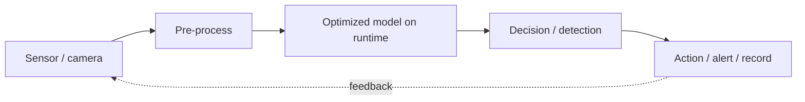

# PoCs, Real-Time Use Cases & Applications

This is where the roadmap pays off: **proof-of-concepts (PoCs)** you can build, **real-time use cases** in production, and **applications by industry** — each mapped to the techniques, runtimes, and pipelines from earlier phases. Every PoC links to a buildable starting point in [sample-projects](../sample-projects/README.md).

## Real-time use cases by industry
| Industry | Real-time use case | Typical stack | Latency need |
|---|---|---|---|
| **Manufacturing** | visual defect detection on a line; predictive maintenance from vibration/sound | YOLO + TensorRT/Hailo; TinyML on MCU | 10s of ms |
| **Retail** | checkout-free vision; shelf/stock analytics; footfall | detection + tracking on Hailo/Qualcomm | real-time video |
| **Smart city / security** | multi-camera analytics; ANPR; anomaly detection | DeepStream multi-stream on Jetson | many streams |
| **Automotive** | driver monitoring (DMS); ADAS perception; autonomous trucking | Ambarella/Qualcomm/NVIDIA | hard real-time |
| **Healthcare** | surgical guidance; patient monitoring; portable diagnostics | Holoscan; edge SoCs | low, deterministic |
| **Agriculture** | weed/pest detection; autonomous machinery; yield estimation | YOLO on Jetson/edge NPU | real-time field |
| **Logistics / robotics** | AMR navigation; pick-and-place; bin picking | ROS 2 + Isaac ROS + VLA policy | real-time control |
| **Energy / infrastructure** | drone inspection of lines/turbines; thermal anomaly detection | Jetson + detection | near-real-time |

## Buildable PoCs (start small, end real)
Each PoC names the **problem**, the **approach**, the **roadmap phases** it exercises, and a **starting point**.

### PoC 1 — Real-time object detection on a Raspberry Pi (beginner)
- **Problem:** detect and count objects in a live camera feed on cheap hardware.
- **Approach:** Raspberry Pi 5 + **Hailo** AI HAT, YOLO via the Hailo runtime/TAPPAS pipeline.
- **Phases:** 2 (YOLO) → 4 (runtime) → 5 (GStreamer pipeline).
- **Start:** [sample-projects/pi5-hailo-live-detection.md](../sample-projects/pi5-hailo-live-detection.md).

### PoC 2 — Zero-hardware image classifier (absolute beginner, runs anywhere)
- **Problem:** classify images with no GPU/NPU — just a laptop.
- **Approach:** **ONNX Runtime** on CPU with a pretrained model; fully commented script.
- **Phases:** 2 → 3 (quantization optional) → 4 (ONNX RT).
- **Start:** [sample-projects/onnxruntime-image-classification.md](../sample-projects/onnxruntime-image-classification.md).

### PoC 3 — High-FPS detection on Jetson (intermediate)
- **Problem:** maximize detection throughput on an NVIDIA edge device.
- **Approach:** export YOLO → **TensorRT** engine; optionally scale streams with DeepStream.
- **Phases:** 3 → 4 (TensorRT) → 5 (DeepStream).
- **Start:** [sample-projects/jetson-yolo-detection.md](../sample-projects/jetson-yolo-detection.md).

### PoC 4 — Predictive maintenance with TinyML (embedded)
- **Problem:** flag a failing motor from vibration, on a battery-powered MCU.
- **Approach:** collect accelerometer data → train a small classifier in **Edge Impulse** → deploy with **LiteRT for Microcontrollers**.
- **Phases:** 1 (TinyML) → 3 (tiny model) → 6 (deploy).
- **Start:** the [foundations](../foundations/README.md) TinyML section + Edge Impulse course in [courses-and-books](../courses-and-books/README.md).

### PoC 5 — On-device LLM/VLM assistant (advanced, GenAI at the edge)
- **Problem:** run a small language/vision-language model locally for privacy.
- **Approach:** INT4-quantized small LLM on **Hailo-10H**, **Jetson**, or **RK3588 (rkllm)**.
- **Phases:** 2 (efficient transformers) → 3 (INT4 quantization) → 4 (runtime).
- **Start:** [model-structures](../model-structures/README.md) GenAI section; hardware notes in the sibling **awesome-physical-ai** repo.

### PoC 6 — Robot perception node (advanced, toward Physical AI)
- **Problem:** give a robot real-time perception that planning/control can use.
- **Approach:** **ROS 2** perception node (detection/segmentation) accelerated by **Isaac ROS / NITROS**; step toward a **VLA policy**.
- **Phases:** 4 → 5 (ROS 2) → 7 (Physical AI).
- **Start:** [pipelines](../pipelines/README.md) ROS 2 section; policies/world-models in **awesome-physical-ai**.

## From PoC to production
A PoC proves feasibility; production adds the [deployment & MLOps](../deployment-and-mlops/README.md) layer — containerization, OTA updates, monitoring, and a retraining loop. The same real-time use cases above become products once that scaffolding is in place.

## The recurring real-time pattern

Every use case on this page is a variation of this loop — the difference is the sensor, the model, and the latency budget.

➡️ Build one now in [sample-projects](../sample-projects/README.md), or revisit the [roadmap](../roadmap/README.md).
