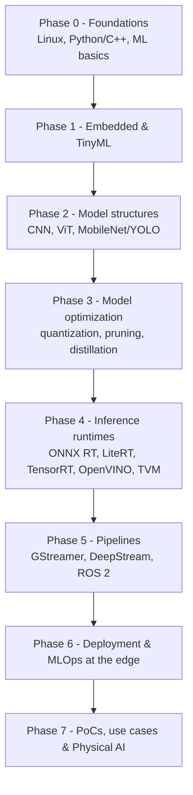

# The Edge AI Roadmap: Beginner → Advanced

A concrete, ordered path from "I know some Python" to "I can ship a real-time, on-device AI system." Each phase states **what to learn**, **why it matters**, and **where to go next** in this repo. The phases are sequential but modular — skip ahead to match your background and hardware.

## Phase 0 — Foundations
**Goal:** be comfortable on a Linux command line and understand what a neural network *is* before deploying one.
- **Linux:** shell, SSH into a headless board, packages, `systemd`, serial console.
- **Programming:** Python for glue + enough **C/C++** to read performance-critical samples.
- **ML basics:** tensors; CNNs vs transformers; classification vs detection vs segmentation; what "INT8" means.
- ➡️ [foundations](../foundations/README.md) · curated [courses-and-books](../courses-and-books/README.md).

## Phase 1 — Embedded systems & TinyML
**Goal:** understand the device you deploy to, and run your first model on a microcontroller.
- SoC (Jetson, Pi, RK3588) vs MCU (ESP32, Cortex-M); cross-compilation; CSI vs USB cameras; I²C/SPI sensors.
- **TinyML:** deploy a tiny model with **LiteRT for Microcontrollers**.
- ➡️ [foundations](../foundations/README.md) · first build in [sample-projects](../sample-projects/README.md).

## Phase 2 — Model structures
**Goal:** know the architectures you'll deploy and why some fit the edge.
- **CNNs** (ResNet), **Vision Transformers (ViT)**, and **efficient families**: MobileNet, EfficientNet, and the **YOLO** detector line.
- Why parameter count, FLOPs, and memory access patterns decide what runs on-device.
- ➡️ [model-structures](../model-structures/README.md).

## Phase 3 — Model optimization
**Goal:** make a model small and fast enough for the edge. This is *the* core edge-AI skill.
- **Quantization** (INT8/INT4), **pruning**, **knowledge distillation**.
- Tools: ONNX Runtime quantization, OpenVINO **NNCF**, **TensorRT Model Optimizer**.
- ➡️ [model-optimization](../model-optimization/README.md) — anchored on MIT 6.5940.

## Phase 4 — Inference runtimes
**Goal:** take an optimized model and run it efficiently on a target.
- **ONNX Runtime** (portable; Execution Providers), **LiteRT** (was TF Lite), **TensorRT** (NVIDIA), **OpenVINO** (Intel), **Apache TVM**, **RKNN** (Rockchip).
- ➡️ [runtimes-and-frameworks](../runtimes-and-frameworks/README.md) — includes a selection matrix.

## Phase 5 — Pipelines
**Goal:** get pixels/sensor data into a model and results back out, in real time.
- **GStreamer** fundamentals; **DeepStream** (NVIDIA) and DL Streamer (Intel); **ROS 2** perception + Isaac ROS / NITROS.
- ➡️ [pipelines](../pipelines/README.md).

## Phase 6 — Deployment & MLOps at the edge
**Goal:** ship it and keep it running across a fleet.
- Containerization, model versioning, OTA updates, monitoring, and the export funnel (PyTorch → ONNX → target).
- ➡️ [deployment-and-mlops](../deployment-and-mlops/README.md).

## Phase 7 — PoCs, real-time use cases & Physical AI
**Goal:** apply it to real problems and step toward robotics.
- End-to-end **proof-of-concepts** and **real-time use cases** by industry.
- Advanced **Physical AI**: VLA policies, sensor fusion, multi-camera systems.
- ➡️ [poc-and-use-cases](../poc-and-use-cases/README.md) · hands-on [sample-projects](../sample-projects/README.md).

## Suggested pace
| Background | To "ship a real-time edge pipeline" |
|---|---|
| Comfortable with Linux + Python | Phases 0–4 in ~6–8 weeks part-time |
| Firmware engineer new to ML | spend more on Phases 2–3; ~3 months |
| ML engineer new to embedded | spend more on Phases 1, 4, 5; ~3 months |

Curated resources for every phase: [courses-and-books](../courses-and-books/README.md) and [awesome-resources](../awesome-resources/README.md).
